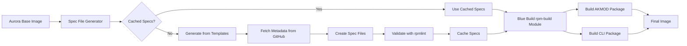

# MyAuroraBluebuild &nbsp; [](https://github.com/abirkel/MyAuroraBluebuild/actions/workflows/build.yml)

> Aurora-based Fedora Atomic image with maccel mouse acceleration and custom packages

A Blue Build-based custom image that provides [Aurora's](https://getaurora.dev/) excellent desktop experience with integrated maccel mouse acceleration and personalized package customization. This project migrates from the custom Vespera Containerfile approach to the standard Blue Build framework while maintaining all existing functionality.

## Features

- **Aurora Base**: Built on Universal Blue's Aurora-nvidia for optimal gaming performance with NVIDIA drivers
- **Maccel Integration**: Self-contained AKMOD-based mouse acceleration driver with automatic kernel module rebuilding
- **Package Customization**: Remove unwanted packages, add preferred alternatives via Blue Build modules
- **Blue Build Framework**: Standard tooling and community-supported approach for maintainability
- **Cryptographic Signing**: Keyless cosign signing for supply chain security using GitHub OIDC
- **Immutable System Optimized**: RPM packages built and integrated at image build time
- **Self-Contained Build**: No external dependencies - all RPM specs generated on-demand from templates

## Installation

### Prerequisites

- Existing Fedora Atomic installation (Silverblue, Kinoite, Aurora, etc.)
- Internet connection for downloading the image
- Administrative access for rpm-ostree operations

### Standard Installation

> [!WARNING]  
> [This is an experimental feature](https://www.fedoraproject.org/wiki/Changes/OstreeNativeContainerStable), try at your own discretion.

**Step 1: Rebase to unsigned image**
```bash
rpm-ostree rebase ostree-unverified-registry:ghcr.io/abirkel/myaurorabluebuild:latest
```

**Step 2: Reboot to apply changes**
```bash
systemctl reboot
```

**Step 3: Rebase to signed image**
```bash
rpm-ostree rebase ostree-image-signed:docker://ghcr.io/abirkel/myaurorabluebuild:latest
```

**Step 4: Final reboot**
```bash
systemctl reboot
```

## Signature Verification

### Keyless Cosign Verification (Recommended)

This image is signed using Sigstore's keyless cosign with GitHub OIDC identity. Verify the signature with:

```bash
cosign verify \
  --certificate-identity-regexp="https://github.com/abirkel/MyAuroraBluebuild" \
  --certificate-oidc-issuer="https://token.actions.githubusercontent.com" \
  ghcr.io/abirkel/myaurorabluebuild:latest
```

### Alternative Verification Methods

**Using Rekor transparency log:**
```bash
cosign verify \
  --rekor-url=https://rekor.sigstore.dev \
  ghcr.io/abirkel/myaurorabluebuild:latest
```

### Verification Before Installation

For maximum security, verify the image signature before rebasing:

```bash
# Verify signature first
cosign verify \
  --certificate-identity-regexp="https://github.com/abirkel/MyAuroraBluebuild" \
  --certificate-oidc-issuer="https://token.actions.githubusercontent.com" \
  ghcr.io/abirkel/myaurorabluebuild:latest

# Only proceed with installation if verification succeeds
rpm-ostree rebase ostree-image-signed:docker://ghcr.io/abirkel/myaurorabluebuild:latest
```

## Maccel Usage

After installation, maccel is ready to use immediately. The AKMOD system automatically rebuilds the kernel module for new kernels.

### Initial Setup

```bash
# Add your user to maccel group (one-time setup)
sudo usermod -aG maccel $USER

# Log out and back in for group changes to take effect
# Or restart your session: sudo systemctl restart display-manager

# Verify that the maccel module is loaded (after reboot)
lsmod | grep maccel
```

### Using Maccel

```bash
# Launch interactive configuration (recommended for first-time users)
maccel tui

# Command line usage
maccel set --sensitivity 1.5
maccel set --curve "0.0 0.0 0.5 0.3 1.0 1.0"
maccel status
maccel reset

# View current configuration
maccel show
```

### Configuration Tips

- **Start with TUI**: Use `maccel tui` for an interactive experience
- **Sensitivity range**: Typically 0.5 (slower) to 2.0 (faster)
- **Curves**: Custom acceleration curves for fine-tuning
- **Persistence**: Configuration automatically persists across reboots
- **Per-device**: Configure different settings for different mice

### Verification

```bash
# Check maccel service status
systemctl --user status maccel

# Verify udev rules are active
ls -la /etc/udev/rules.d/99-maccel.rules

# Check group membership
groups | grep maccel

# Verify AKMOD is configured (kernel module will rebuild automatically on kernel updates)
ls -la /usr/src/akmods/
```

## Customization

### Recipe Configuration

This image is built using Blue Build's `recipe.yml` configuration. You can customize the image by modifying `recipes/recipe.yml` and rebuilding.

#### Base Image Options

```yaml
# Current configuration
base-image: ghcr.io/ublue-os/aurora-nvidia
image-version: latest

# Some alternative base images
base-image: ghcr.io/ublue-os/aurora        # AMD/Intel graphics
base-image: ghcr.io/ublue-os/silverblue   # GNOME desktop
base-image: ghcr.io/ublue-os/kinoite      # KDE desktop
```

#### Maccel Version Pinning

Control which maccel version to build:

```yaml
# In recipe.yml or GitHub Actions workflow
# Pin to specific version
env:
  MACCEL_VERSION: "0.4.1"

# Or use latest (default)
env:
  MACCEL_VERSION: "latest"
```

#### Package Management

**Adding/Removing RPM Packages:**
```yaml
modules:
  - type: dnf
    remove:
      packages:
        - sunshine          # Remove game streaming
    install:
      packages:
        - htop             # Process viewer
        - neovim           # Text editor
        - git-lfs          # Git large file support
```

**Managing Flatpak Applications:**
```yaml
modules:
  - type: default-flatpaks
    configurations:
      - scope: system
        remove:
          - org.mozilla.Thunderbird      # Remove email client
          - org.libreoffice.LibreOffice  # Remove office suite
        install:
          - org.keepassxc.KeePassXC      # Password manager
          - com.github.tchx84.Flatseal   # Flatpak permissions
          - org.blender.Blender          # 3D modeling
```

#### Custom Scripts

Add custom installation scripts in `files/scripts/`:

```yaml
modules:
  - type: script
    scripts:
      - your-custom-script.sh
```

### Building Your Custom Image

1. **Fork this repository**
2. **Modify `recipes/recipe.yml`** with your customizations
3. **Update repository settings:**
   - Enable GitHub Actions
   - Set repository visibility (public for ghcr.io)
4. **Push changes** - GitHub Actions will build automatically
5. **Install your custom image:**
   ```bash
   rpm-ostree rebase ostree-image-signed:docker://ghcr.io/YOUR_USERNAME/myaurorabluebuild:latest
   ```

### Advanced Customization

#### Multiple Variants

Create different recipe files for different use cases:

```
recipes/
├── recipe.yml          # Default variant
├── gaming.yml          # Gaming-focused
├── development.yml     # Development tools
└── minimal.yml         # Minimal installation
```

#### Custom Modules

Refer to [Blue Build documentation](https://blue-build.org/reference/modules/) for available modules:

- `dnf`: Package management
- `default-flatpaks`: Flatpak management  
- `script`: Custom scripts
- `files`: File operations
- `systemd`: Service management
- `signing`: Image signing

## Troubleshooting

### Installation Issues

**Problem: rpm-ostree rebase fails with signature verification error**
```bash
# Solution: Verify image signature manually first
cosign verify \
  --certificate-identity-regexp="https://github.com/abirkel/MyAuroraBluebuild" \
  --certificate-oidc-issuer="https://token.actions.githubusercontent.com" \
  ghcr.io/abirkel/myaurorabluebuild:latest

# If verification fails, check for latest image
podman pull ghcr.io/abirkel/myaurorabluebuild:latest
```

**Problem: Rebase hangs or fails to download**
```bash
# Solution: Clear rpm-ostree cache and retry
sudo rpm-ostree cleanup -m
sudo rpm-ostree rebase ostree-image-signed:docker://ghcr.io/abirkel/myaurorabluebuild:latest
```

**Problem: Boot fails after rebase**
```bash
# Solution: Boot into previous deployment
# At GRUB menu, select previous deployment
# Then rollback:
rpm-ostree rollback
systemctl reboot
```

### Maccel Issues

**Problem: maccel command not found**
```bash
# Check if maccel package is installed
rpm -q maccel

# Verify PATH includes /usr/bin
echo $PATH

# Check if akmod-maccel is installed
rpm -q akmod-maccel
```

**Problem: maccel module not loaded**
```bash
# Check kernel module
lsmod | grep maccel

# AKMOD rebuilds automatically on boot for new kernels
# Check akmods service status
systemctl status akmods

# Check for module building errors
journalctl -u akmods

# Check AKMOD source files
ls -la /usr/src/akmods/maccel-*

# Manually trigger AKMOD rebuild if needed
sudo akmods --force
```

**Problem: Permission denied when using maccel**
```bash
# Verify user is in maccel group
groups | grep maccel

# Add user to group if missing
sudo usermod -aG maccel $USER

# Check udev rules
ls -la /etc/udev/rules.d/99-maccel.rules

# Reload udev rules if needed
sudo udevadm control --reload-rules
sudo udevadm trigger
```

**Problem: maccel settings don't persist**
```bash
# Check maccel config directory
ls -la ~/.config/maccel/

# Verify maccel service
systemctl --user status maccel

# Enable service if disabled
systemctl --user enable --now maccel
```

### Build Issues

**Problem: GitHub Actions build fails**
```bash
# Check build logs in Actions tab
# Common issues:
# 1. Recipe syntax errors - validate YAML
# 2. Package conflicts - check dnf module configuration
# 3. Spec generation errors - check generate-maccel-specs.sh logs
# 4. RPM build failures - check rpm-build module logs
```

**Problem: Spec file generation fails**
```bash
# Check if maccel version exists
# View available versions at: https://github.com/Gnarus-G/maccel/releases

# Check spec generation logs in GitHub Actions
# Look for errors in generate-maccel-specs.sh output

# Verify template files exist
ls -la files/templates/

# Test spec generation locally (if you have the repo cloned)
MACCEL_VERSION=latest bash files/scripts/generate-maccel-specs.sh
```

**Problem: RPM build fails**
```bash
# Check rpm-build module logs in GitHub Actions
# Common issues:
# 1. Missing build dependencies
# 2. Spec file syntax errors
# 3. Source download failures

# Validate spec files with rpmlint (if testing locally)
rpmlint specs/maccel-*/akmod-maccel.spec
rpmlint specs/maccel-*/maccel.spec
```

### Getting Help

1. **Check build logs**: GitHub Actions → Build workflow → Logs
2. **Verify requirements**: Ensure Fedora Atomic base system
3. **Community support**: 
   - [Blue Build Discord](https://discord.gg/blue-build)
   - [Universal Blue Discord](https://discord.gg/universal-blue)
   - [Maccel GitHub Issues](https://github.com/Gnarus-G/maccel/issues)
4. **File issues**: [MyAuroraBluebuild Issues](https://github.com/abirkel/MyAuroraBluebuild/issues)

## Architecture

MyAuroraBluebuild uses a self-contained build system that generates RPM spec files on-demand and builds maccel packages directly within the image build process.

### Build Flow



### Key Components

- **Aurora Base**: Provides KDE desktop with gaming optimizations
- **Blue Build Framework**: Declarative image building with YAML configuration
- **Spec File Generator**: On-demand generation of RPM spec files from templates
- **Spec File Cache**: Version-organized cache of generated specs for reuse
- **AKMOD Integration**: Automatic kernel module rebuilding for new kernels
- **rpm-build Module**: Direct RPM package building within Blue Build
- **Cosign Signing**: Keyless image signing for supply chain security

### Self-Contained Approach

The build system is completely self-contained:

1. **No External Dependencies**: All RPM building happens within the Blue Build process
2. **Template-Based**: Spec files generated from templates with metadata from upstream
3. **Cached for Efficiency**: Generated specs cached by version to avoid regeneration
4. **AKMOD for Compatibility**: Kernel modules automatically rebuild for new kernels
5. **Transparent**: All spec files committed to repository for auditability

## Migration from Vespera

### Differences from Vespera

| Aspect | Vespera | MyAuroraBluebuild |
|--------|---------|-------------------|
| Build System | Custom Containerfile | Blue Build Framework |
| Configuration | vespera-config.yaml | recipe.yml |
| Maccel Integration | DKMS compilation | AKMOD with on-demand spec generation |
| Kernel Compatibility | Manual rebuilds | Automatic AKMOD rebuilds |
| Signing | GPG keys | Keyless cosign |
| Maintenance | Manual updates | Community tooling |
| Dependencies | None | None (self-contained) |

### Migration Steps

1. **Backup current configuration** (optional):
   ```bash
   # Export current maccel settings
   maccel show > ~/maccel-backup.txt
   ```

2. **Clean migration** (recommended):
   ```bash
   # Rebase to clean Fedora
   rpm-ostree rebase fedora:fedora/41/x86_64/silverblue
   systemctl reboot
   
   # Install MyAuroraBluebuild
   rpm-ostree rebase ostree-image-signed:docker://ghcr.io/abirkel/myaurorabluebuild:latest
   systemctl reboot
   ```

3. **Restore maccel configuration**:
   ```bash
   # Add user to maccel group
   sudo usermod -aG maccel $USER
   
   # Restore settings (if backed up)
   # maccel set --sensitivity YOUR_VALUE
   ```

### What's Preserved

- **Home directory**: All personal files and configurations
- **Flatpak applications**: User-installed Flatpaks remain
- **User settings**: Desktop preferences, application configurations

### What Changes

- **System packages**: New package selection based on recipe.yml
- **Maccel installation**: Now uses AKMOD for automatic kernel module rebuilding
- **Update mechanism**: Blue Build framework instead of custom CI/CD
- **Kernel updates**: AKMOD automatically rebuilds modules for new kernels

## Resources

### Documentation
- [Blue Build Documentation](https://blue-build.org/) - Framework documentation and module reference
- [Aurora Documentation](https://getaurora.dev/) - Base image documentation and features
- [Maccel GitHub](https://github.com/Gnarus-G/maccel) - Mouse acceleration driver documentation
- [Fedora Atomic Documentation](https://docs.fedoraproject.org/en-US/fedora-silverblue/) - Immutable OS concepts
- [rpm-ostree Documentation](https://rpm-ostree.readthedocs.io/) - Package layering and rebasing

### Community
- [Blue Build Discord](https://discord.gg/blue-build) - Blue Build community support
- [Universal Blue Discord](https://discord.gg/universal-blue) - Aurora and Universal Blue community
- [Fedora Discussion](https://discussion.fedoraproject.org/) - General Fedora support

### Related Projects
- [Universal Blue](https://universal-blue.org/) - Custom Fedora Atomic images
- [Sigstore](https://www.sigstore.dev/) - Supply chain security and signing
- [AKMOD](https://rpmfusion.org/Packaging/KernelModules/Akmods) - Automatic kernel module building system

## Contributing

1. **Fork the repository**
2. **Create a feature branch**: `git checkout -b feature-name`
3. **Make changes** to `recipes/recipe.yml` or documentation
4. **Test locally** with Blue Build CLI (optional)
5. **Submit a pull request**

### Development Setup

```bash
# Install Blue Build CLI (optional, for local testing)
curl -s https://blue-build.org/install.sh | bash

# Validate recipe syntax
bluebuild validate recipes/recipe.yml

# Build locally (requires podman/docker)
bluebuild build recipes/recipe.yml
```

## License

This project configuration is provided as-is for personal use. Respects licenses of:
- **Aurora**: Apache 2.0
- **Maccel**: MIT  
- **Blue Build**: Apache 2.0
- **Fedora packages**: Various (see individual package licenses)

## Acknowledgments

- **Universal Blue team** for Aurora base image and ecosystem
- **Blue Build maintainers** for the excellent framework
- **Maccel developer** for the mouse acceleration driver
- **Fedora Project** for the solid foundation
