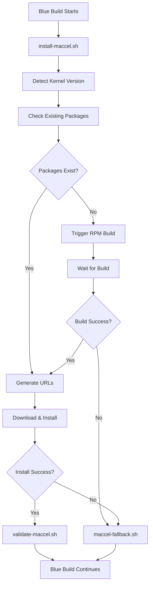

# MyAuroraBluebuild Maccel Integration Scripts

This directory contains the scripts that handle maccel mouse acceleration integration for MyAuroraBluebuild. These scripts implement the coordination between the Blue Build workflow and the maccel-rpm-builder system.

## Scripts Overview

### Core Integration Scripts

#### `install-maccel.sh`
**Primary integration script** - Handles the complete maccel integration process:
- Detects kernel version from the current system
- Coordinates with maccel-rpm-builder via repository dispatch
- Downloads and installs RPM packages
- Verifies maccel configuration (group, udev rules, module loading)
- Implements fallback mechanisms for failures

**Usage**: Automatically executed by Blue Build during image creation
**Requirements**: GitHub token for repository dispatch (GITHUB_TOKEN or DISPATCH_TOKEN)

#### `validate-maccel.sh`
**Post-installation validation** - Verifies maccel configuration after installation:
- Validates maccel group exists
- Checks udev rules are properly configured
- Verifies module loading configuration
- Tests installed packages and CLI accessibility
- Provides detailed validation reporting

**Usage**: Automatically executed after `install-maccel.sh`
**Requirements**: None (validation only)

### Utility Scripts

#### `check-maccel-packages.sh`
**Package detection utility** - Provides efficient package detection and coordination:
- Checks for existing packages to avoid unnecessary builds
- Generates package download URLs
- Verifies package accessibility
- Gets latest maccel version information
- Lists available releases

**Usage**: Can be used standalone or by other scripts
**Commands**:
```bash
./check-maccel-packages.sh check <kernel_version> <maccel_version>
./check-maccel-packages.sh urls <kernel_version> <maccel_version> <fedora_version>
./check-maccel-packages.sh verify <kmod_url> <cli_url>
./check-maccel-packages.sh latest-maccel
```

#### `maccel-fallback.sh`
**Fallback mechanism handler** - Provides graceful degradation when integration fails:
- Creates user notices about integration failures
- Sets up desktop notifications
- Provides alternative mouse acceleration options
- Creates troubleshooting information
- Logs failure details for debugging

**Usage**: Automatically called by `install-maccel.sh` on failures
**Requirements**: None (fallback only)

## Integration Flow



## Configuration Requirements

### Environment Variables

#### Required for Repository Dispatch
- `GITHUB_TOKEN` or `DISPATCH_TOKEN`: GitHub token with repository dispatch permissions
  - Must have access to `abirkel/maccel-rpm-builder` repository
  - Used for triggering RPM builds when packages don't exist

#### Optional
- `MACCEL_VERSION`: Specific maccel version to use (defaults to latest)
- `FORCE_REBUILD`: Force rebuild even if packages exist (defaults to false)

### GitHub Secrets Setup

In your MyAuroraBluebuild repository, configure:

```yaml
# .github/workflows/build.yml
env:
  GITHUB_TOKEN: ${{ secrets.DISPATCH_TOKEN || github.token }}
```

Create `DISPATCH_TOKEN` secret with a GitHub personal access token that has:
- `repo` scope for private repositories
- `public_repo` scope for public repositories
- Access to `abirkel/maccel-rpm-builder` repository

## Error Handling

### Integration Failures

The scripts implement comprehensive error handling:

1. **Network Issues**: Retry mechanisms and fallback to curl if gh CLI fails
2. **Package Unavailability**: Automatic build triggering and waiting
3. **Build Timeouts**: Graceful fallback with user notifications
4. **Installation Failures**: Detailed error logging and fallback mechanisms

### Fallback Mechanisms

When integration fails, the system:
- Creates user notices with manual installation instructions
- Sets up desktop notifications for first boot
- Provides alternative mouse acceleration options
- Creates troubleshooting documentation
- Logs detailed failure information

### Recovery Options

Users can recover from integration failures by:
1. Using maccel's native installer
2. Installing RPM packages manually
3. Building from source
4. Using alternative libinput acceleration

## Testing and Validation

### Local Testing

Test individual scripts:
```bash
# Test package detection
./check-maccel-packages.sh check 6.11.5-300.fc41.x86_64 1.0.0

# Test URL generation
./check-maccel-packages.sh urls 6.11.5-300.fc41.x86_64 1.0.0 41

# Test validation (after installation)
./validate-maccel.sh

# Test fallback mechanisms
./maccel-fallback.sh "Test failure reason"
```

### Integration Testing

The scripts are automatically tested during Blue Build workflow execution. Monitor:
- GitHub Actions workflow logs
- Package availability checks
- Installation success/failure
- Validation results

## Troubleshooting

### Common Issues

#### Repository Dispatch Failures
```
Error: Failed to send repository dispatch
```
**Solution**: Check GITHUB_TOKEN/DISPATCH_TOKEN permissions and repository access

#### Package Detection Failures
```
Error: Could not detect kernel version
```
**Solution**: Verify base image accessibility and label format

#### Installation Failures
```
Error: Failed to install maccel packages with rpm-ostree
```
**Solution**: Check package URLs and rpm-ostree functionality

### Debug Information

Scripts provide detailed logging:
- Timestamps for all operations
- Environment variable status
- Network connectivity checks
- Package availability verification
- Installation step-by-step progress

### Log Locations

- Integration logs: Included in Blue Build workflow output
- Failure logs: `/var/log/maccel-integration-failure.log`
- User notices: `/etc/maccel-integration-notice.txt`
- Troubleshooting info: `/etc/maccel-troubleshooting.txt`

## Maintenance

### Updating Scripts

When updating scripts:
1. Test changes locally when possible
2. Update version references if needed
3. Verify error handling still works
4. Update documentation
5. Test in Blue Build workflow

### Monitoring

Monitor for:
- Changes in maccel upstream releases
- Changes in Aurora base image kernel versions
- Changes in maccel-rpm-builder API
- GitHub API rate limits or access issues

### Dependencies

Scripts depend on:
- `curl`: HTTP requests and downloads
- `jq`: JSON parsing (fallback parsing if not available)
- `gh`: GitHub CLI (fallback to curl if not available)
- `rpm-ostree`: Package installation
- `systemctl`: Service management
- Standard shell utilities: `grep`, `sed`, `awk`, etc.

## Security Considerations

### Token Security
- Use repository secrets for GitHub tokens
- Limit token permissions to minimum required
- Rotate tokens regularly

### Package Verification
- Packages are downloaded from GitHub releases
- URLs are generated deterministically
- Package accessibility is verified before installation

### Fallback Security
- Fallback mechanisms don't compromise system security
- User notices provide safe manual installation options
- No automatic execution of untrusted code

## Contributing

When contributing to these scripts:
1. Follow existing error handling patterns
2. Add comprehensive logging
3. Test both success and failure scenarios
4. Update documentation
5. Consider impact on maccel-rpm-builder coordination

## Related Documentation

- [Blue Build Integration Guide](../../.rpm-integration-docs/BLUE_BUILD_INTEGRATION.md)
- [maccel-rpm-builder README](../../.rpm-integration-docs/README.md)
- [MyAuroraBluebuild Requirements](../../.kiro/specs/bluebuild-migration/requirements.md)
- [MyAuroraBluebuild Design](../../.kiro/specs/bluebuild-migration/design.md)